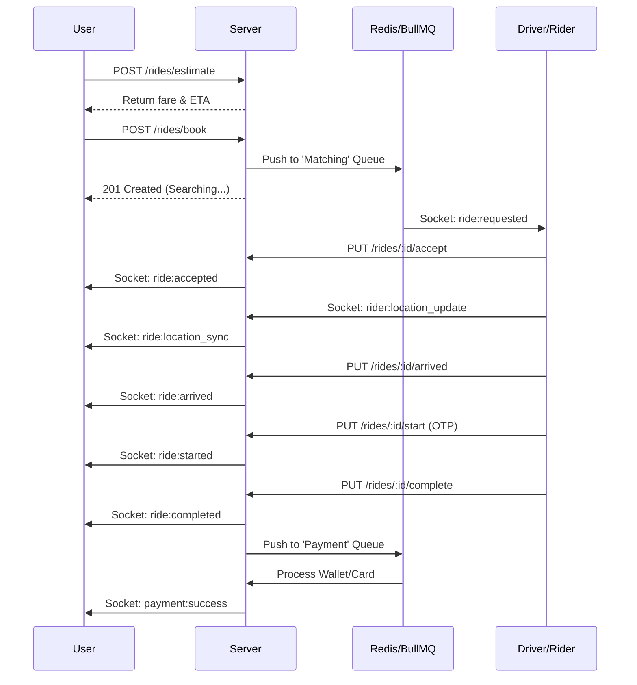

# Ride Booking Flow

This document details the end-to-end flow of booking and completing a ride in the Easy Ride platform.

## 🗺️ Visual Flow

---

## 🛠️ Internal Mechanisms

### 1. Smart Matching
When a user books a ride, the system:
1. Identifies the nearest 10-20 online riders using Redis **GEORADIUS**.
2. Filters riders based on vehicle type and category.
3. Sends a socket notification to the top-ranked rider.
4. If the rider doesn't respond within 30 seconds, the BullMQ worker moves to the next rider.

### 2. OTP Verification
To ensure the correct rider picks up the correct user:
- A 4-digit OTP is generated upon booking.
- The user shares this with the rider.
- The rider must provide this OTP to the `/start` endpoint to begin the trip.

### 3. Real-time Synchronization
Rider coordinates are updated via Socket.IO and cached in Redis for high-performance retrieval. Users listen to the `ride:{rideId}` room for live updates.

---

## 📋 State Transitions
| From | To | Trigger |
|---|---|---|
| `searching` | `accepted` | Rider accepts ride |
| `accepted` | `arriving` | Rider marks as arrived |
| `arriving` | `started` | OTP verification successful |
| `started` | `completed` | Rider ends trip |
| `searching`/`accepted` | `cancelled` | User/Rider cancels |
